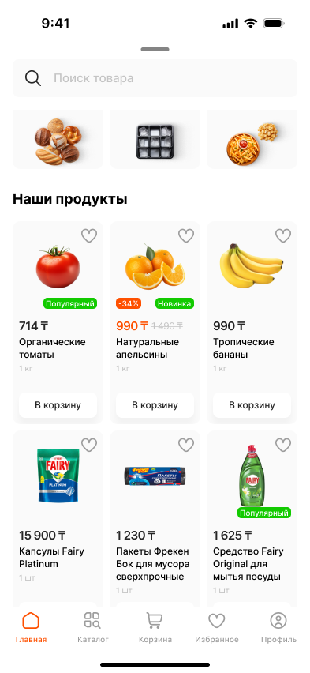
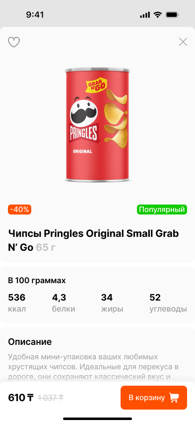
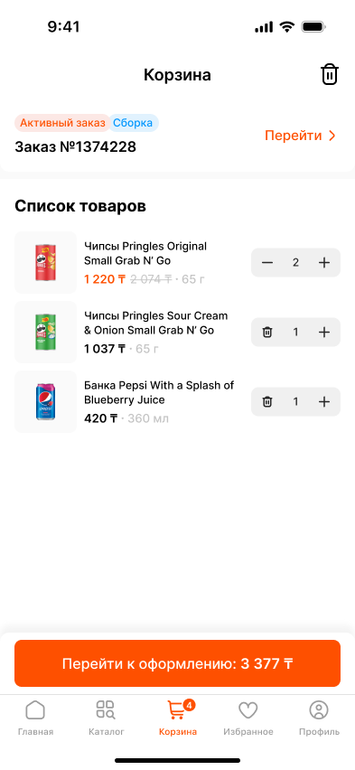

# 🛒 Grocery App - Flutter Clean Architecture Showcase

[](https://flutter.dev/)
[](https://dart.dev/)
[](LICENSE)
[](CONTRIBUTING.md)

A professional Flutter grocery delivery application demonstrating Clean Architecture, BLoC pattern, and modern development best practices. This project serves as a comprehensive example of building scalable, maintainable, and testable Flutter applications.

## 📸 Screenshots

<div align="center">

| Home Screen | Products | Product Details | Shopping Cart |
|------------|----------|-----------------|---------------|
|  |  |  |  |

</div>

## ✨ Features

### Core Functionality
- 🛍️ **Product Catalog** - Browse products by categories and subcategories
- 🔍 **Smart Search** - Advanced search with real-time suggestions
- 🛒 **Shopping Cart** - Persistent cart using Hive local database
- 📦 **Order Management** - Complete order lifecycle with real-time tracking
- 💳 **Multiple Payment Methods** - Cards, cash, and QR payments
- 📍 **Address Management** - Yandex Maps integration for delivery addresses
- ⭐ **Favorites** - Save favorite products for quick access
- 🔔 **Push Notifications** - Firebase Cloud Messaging integration

### Technical Features
- 🏗️ **Clean Architecture** - Separation of concerns across three layers
- 🎯 **BLoC Pattern** - Predictable state management
- 🌍 **Internationalization** - Support for English, Russian, and Kazakh
- 🔄 **OTA Updates** - Shorebird code push integration
- 📊 **Analytics** - Firebase Analytics & AppsFlyer
- 🔐 **Secure Authentication** - Phone number + OTP verification
- 🎨 **Responsive UI** - Adaptive layouts for different screen sizes
- ⚡ **Performance** - Optimized image loading and caching

## 🏗️ Architecture

This project follows **Clean Architecture** principles with a clear separation of concerns:

```
┌─────────────────────────────────────────────┐
│         Presentation Layer                   │
│   • Screens (UI)                            │
│   • BLoC (State Management)                 │
│   • Widgets (Reusable Components)           │
└─────────────────────────────────────────────┘
                    ↓
┌─────────────────────────────────────────────┐
│          Domain Layer                        │
│   • Entities (Business Models)              │
│   • Use Cases (Business Logic)              │
│   • Repository Interfaces                   │
└─────────────────────────────────────────────┘
                    ↓
┌─────────────────────────────────────────────┐
│           Data Layer                         │
│   • Repository Implementations              │
│   • Data Sources (Remote & Local)           │
│   • Models (Data Transfer Objects)          │
└─────────────────────────────────────────────┘
```

### Architectural Patterns

- **Clean Architecture**: Clear separation of business logic from UI and data sources
- **BLoC Pattern**: Unidirectional data flow for predictable state management
- **Repository Pattern**: Abstract data layer from business logic
- **Dependency Injection**: GetIt service locator for loose coupling
- **Type-Safe Routing**: AutoRoute for compile-time route safety
- **Functional Programming**: dartz for functional error handling (`Either<Failure, Success>`)

## 🛠️ Tech Stack

### Core
- **Flutter SDK**: >=3.3.4 <4.0.0
- **Dart SDK**: >=3.3.4

### State Management
- `flutter_bloc` ^8.1.2 - BLoC/Cubit implementation

### Networking
- `dio` ^5.0.2 - HTTP client with interceptors
- `connectivity_plus` ^6.1.0 - Network connectivity
- `internet_connection_checker` ^1.0.0+1 - Internet status

### Local Storage
- `hive` ^2.2.3 - NoSQL database
- `hive_flutter` ^1.1.0 - Hive Flutter integration
- `shared_preferences` ^2.0.18 - Key-value storage
- `get_storage` ^2.0.3 - Fast key-value storage

### Navigation
- `auto_route` ^8.1.3 - Declarative routing

### Firebase
- `firebase_core` ^3.7.0
- `firebase_messaging` ^15.1.4 - Push notifications
- `firebase_crashlytics` ^4.1.4 - Crash reporting
- `firebase_analytics` ^11.3.4 - Analytics
- `firebase_remote_config` ^5.1.2 - Remote configuration

### Maps & Location
- `yandex_mapkit` ^4.1.0 - Yandex Maps SDK
- `geolocator` ^13.0.1 - GPS location services

### UI Components
- `flutter_screenutil` ^5.9.0 - Responsive UI
- `cached_network_image` ^3.3.1 - Image caching
- `shimmer` ^3.0.0 - Skeleton loading
- `flutter_svg` ^2.0.5 - SVG support
- `pin_code_fields` ^8.0.1 - OTP input
- `smooth_page_indicator` ^1.1.0 - Page indicators

### Code Generation
- `build_runner` ^2.4.8
- `auto_route_generator` ^8.0.0
- `hive_generator` ^2.0.1

### Other
- `dartz` ^0.10.1 - Functional programming
- `equatable` ^2.0.3 - Value equality
- `get_it` ^7.2.0 - Dependency injection
- `shorebird_code_push` ^1.1.6 - OTA updates
- `appsflyer_sdk` ^6.15.2 - Attribution

## 📦 Project Structure

```
lib/
├── main.dart                           # Application entry point
├── firebase_options.dart               # Firebase configuration
└── src/
    ├── application.dart                # Root widget
    ├── get_it_sl.dart                  # Dependency injection setup
    │
    ├── core/                           # Core functionality
    │   ├── error/                      # Error handling
    │   │   ├── exception.dart          # Exception definitions
    │   │   └── failure.dart            # Failure classes
    │   ├── usecases/                   # Base use case
    │   │   └── usecase.dart
    │   └── check_error_type.dart       # Network error helper
    │
    ├── data/                           # Data layer
    │   ├── datasources/                # Remote & local data sources
    │   │   ├── product_remote_data_source.dart
    │   │   ├── order_remote_data_source.dart
    │   │   └── user_remote_data_source.dart
    │   ├── models/                     # Data models (JSON serializable)
    │   │   ├── product/
    │   │   ├── order/
    │   │   └── user/
    │   ├── repository/                 # Repository implementations
    │   │   ├── product_service_repository.dart
    │   │   ├── order_service_repository.dart
    │   │   └── user_service_repository.dart
    │   └── hive/                       # Local database
    │       ├── hive_database.dart
    │       └── adapter/
    │
    ├── domain/                         # Domain layer
    │   ├── entity/                     # Business entities
    │   │   ├── product/
    │   │   ├── order/
    │   │   └── user/
    │   ├── repository/                 # Repository interfaces
    │   │   ├── abstract_product_service_profile.dart
    │   │   ├── abstract_order_service_profile.dart
    │   │   └── abstract_user_service_profile.dart
    │   └── usecase/                    # Business logic use cases
    │       ├── product/
    │       ├── order/
    │       └── user/
    │
    ├── presentation/                   # Presentation layer
    │   ├── bloc/                       # Global BLoCs
    │   │   ├── nav_bar_bloc.dart
    │   │   ├── search_bloc/
    │   │   └── remote_config_cubit.dart
    │   ├── view/                       # Feature screens
    │   │   ├── home/                   # Home feature
    │   │   │   ├── bloc/
    │   │   │   ├── screens/
    │   │   │   └── widgets/
    │   │   ├── basket/                 # Shopping cart
    │   │   ├── category/
    │   │   ├── favorite/
    │   │   ├── product/
    │   │   ├── profile/
    │   │   └── authorization/
    │   └── widgets/                    # Reusable widgets
    │       ├── buttons/
    │       ├── text_fields/
    │       └── modal_bottoms/
    │
    ├── common/                         # Shared utilities
    │   ├── app_styles/                 # Theme, colors, typography
    │   ├── utils/                      # Helpers and utilities
    │   │   ├── l10n/                   # Localization
    │   │   ├── firebase_api/           # Firebase helpers
    │   │   ├── geocoding/              # Maps helpers
    │   │   └── app_router/             # Routing
    │   ├── api.dart                    # API client
    │   ├── constants.dart              # App constants
    │   ├── enums.dart                  # Enums
    │   ├── env_config.dart             # Environment config (gitignored)
    │   └── env_config.example.dart     # Config template
    │
    └── platform/                       # Platform-specific code
        └── network_info.dart
```

## 🚀 Getting Started

### Prerequisites

- Flutter SDK (>=3.3.4)
- Dart SDK (>=3.3.4)
- Xcode 14+ (for iOS development)
- Android Studio / VS Code
- CocoaPods (for iOS dependencies)

### Installation

1. **Clone the repository**
   ```bash
   git clone https://github.com/yourusername/grocery_app.git
   cd grocery_app
   ```

2. **Install dependencies**
   ```bash
   flutter pub get
   ```

3. **Set up environment configuration**
   ```bash
   cp lib/src/common/env_config.example.dart lib/src/common/env_config.dart
   ```

   Then edit `lib/src/common/env_config.dart` with your API keys:
   - Google Maps API Key
   - Firebase configuration
   - API endpoints

4. **Set up Firebase** (Optional for showcase)
   - Create a Firebase project
   - Add `google-services.json` to `android/app/`
   - Add `GoogleService-Info.plist` to `ios/Runner/`
   - Or use the project with `useMockData: true` flag

5. **Generate code**
   ```bash
   flutter pub run build_runner build --delete-conflicting-outputs
   ```

6. **Run the app**
   ```bash
   flutter run
   ```

## 🔐 Environment Configuration

This project uses environment-based configuration for sensitive data.

**Important**: Never commit `env_config.dart` to version control!

```dart
class EnvConfig {
  static const String googleMapsApiKey = 'YOUR_API_KEY';
  static const String apiBaseUrl = 'https://api.example.com/v1/';
  static const bool useMockData = true; // Set to true for demo mode
}
```

## 🧪 Testing

```bash
# Run all tests
flutter test

# Run with coverage
flutter test --coverage

# Generate coverage report
genhtml coverage/lcov.info -o coverage/html
```

## 📱 Building

### Android

```bash
# Debug APK
flutter build apk

# Release APK
flutter build apk --release

# App Bundle (for Play Store)
flutter build appbundle --release
```

### iOS

```bash
# Debug build
flutter build ios

# Release build
flutter build ios --release

# Create IPA
flutter build ipa --release
```

## 🌍 Localization

Supports three languages:
- 🇺🇸 English (en)
- 🇷🇺 Russian (ru)
- 🇰🇿 Kazakh (kk)

Localization files are in `assets/l10n/`. To add new translations:

1. Edit ARB files in `assets/l10n/`
2. Run `flutter pub get` to regenerate

## 🤝 Contributing

Contributions are welcome! Please read [CONTRIBUTING.md](CONTRIBUTING.md) for details.

1. Fork the repository
2. Create your feature branch (`git checkout -b feature/amazing-feature`)
3. Commit your changes (`git commit -m 'Add amazing feature'`)
4. Push to the branch (`git push origin feature/amazing-feature`)
5. Open a Pull Request

## 📄 License

This project is licensed under the MIT License - see the [LICENSE](LICENSE) file for details.

## 📚 Documentation

- [Architecture Guide](ARCHITECTURE.md)
- [Contributing Guidelines](CONTRIBUTING.md)
- [Security Policy](SECURITY.md)

## 🎯 Key Learnings & Best Practices

This showcase demonstrates:

1. **Clean Architecture** - How to structure a large-scale Flutter app
2. **BLoC Pattern** - Predictable state management with separation of concerns
3. **Dependency Injection** - Using GetIt for loose coupling
4. **Error Handling** - Functional approach with dartz Either
5. **Code Generation** - Leveraging build_runner for productivity
6. **Testing** - Writing testable code with clear boundaries
7. **Localization** - Multi-language support
8. **Firebase Integration** - Analytics, Crashlytics, Remote Config
9. **Performance** - Image caching, lazy loading, pagination
10. **Security** - Proper API key management and authentication

## 🙏 Acknowledgments

- Flutter team for the amazing framework
- Community packages that made this possible
- All contributors to this project

## 📧 Contact

- GitHub: [@Abylai07](https://github.com/Abylai07)
- Email: abylaianayat@gmail.com

---

**Made with ❤️ using Flutter**

_This is a showcase project demonstrating modern Flutter development practices._
